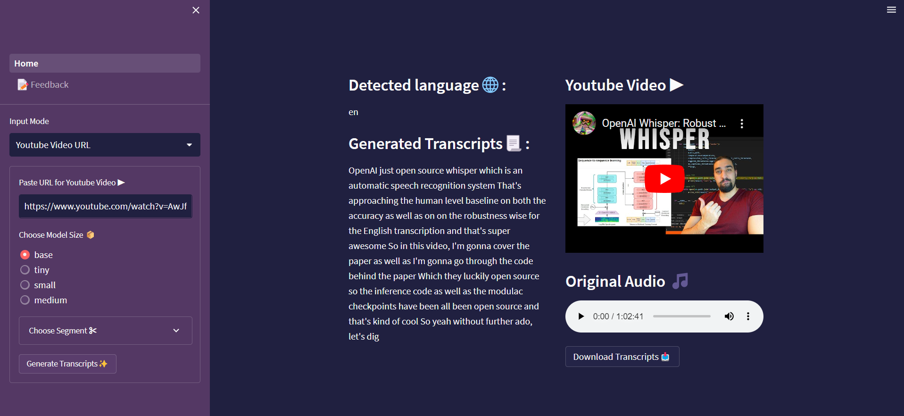
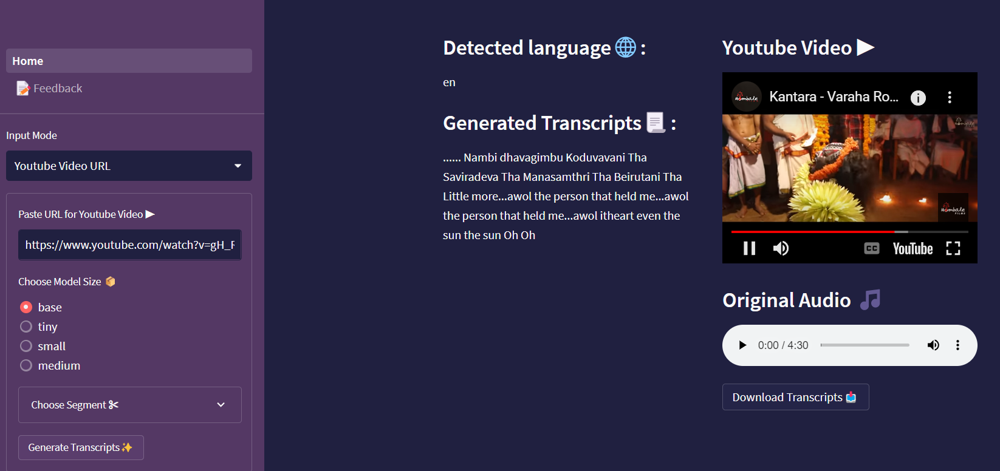

## AI Audio Transcriber

<p align = "center"></p>

A minimalistic application to generate transcriptions for audio built using Python


## Set-Up ⚒️

<p align = "center"></p>

- Ensure you have the latest stable version of [Python](https://www.python.org/downloads/) in your system

- Open your terminal / command prompt. 

- Clone the repository 
    ```
    git clone https://github.com/smaranjitghose/AIAudioTranscriber.git
    ```
- Change the directory to the cloned project
    
    ```
    cd AIAudioTranscriber
    ```

- Install the dependencies

    ```
    pip install -r requirements.txt
    ```


- Install ffmpeg on your system

```
# on Ubuntu or Debian
sudo apt update && sudo apt install ffmpeg

# on Arch Linux
sudo pacman -S ffmpeg

# on MacOS using Homebrew (https://brew.sh/)
brew install ffmpeg

# on Windows using Chocolatey (https://chocolatey.org/)
choco install ffmpeg

# on Windows using Scoop (https://scoop.sh/)
scoop install ffmpeg
```

- Load the application

    ```
    streamlit run .\Home.py
    ```

- If the app does not load by itself in your default browser, open a browser of your choice and navigate to  `http://localhost:8501`

- To stop the application, press `CTRL + C` in your terminal

## Demo 👇

**v.0.0.1**
<p align = "center"></p>

**v.0.0.2** (Transcribing a Youtube Video Explaining Whisper)
<p align = "center"></p>

**v.0.0.2** (Transcribing an English Song - Thinkin About It)
<p align = "center"></p>

## Note ✏️

<p align = "center"></p>

- For Streamlit Sharing, mentioning versions of the modules in requirements throws error at times
- Large Modelv2 outperforms all other versions of Whisper in terms of performance especially in Multi-lingual Transcription. However, it takes a 10 times more V-RAM than the base model and has longer inference time
- To quickly record audio from system microphone use [this](https://github.com/smaranjitghose/miscellaneous/blob/master/handypython/data/audio/audio_recording.py) Python Script:
    - Pre-requisities:

        ```
        pip install pyaudio wave
        ```
- Whisper is unable to read audio file from disk if ``python-ffmpeg`` or ``ffmpeg`` python pacakges are installed. It only works when ``ffmpeg-python`` python package is installed and not the former too

    ```
    # Remove all ffmpeg related python packages
    pip uninstall python-ffmpeg ffmpeg ffmpeg-python
    # Install the appropriate pacakge for ffmpeg
    pip install ffmpeg-python

    ```
- [Pixabay](https://pixabay.com/) has a great collection of copyright free, no royalty songs that one can use for testing the application
- Poor Performance for Kanada or Telegu songs (often language recognition itself fails) for base model. Example: Kantara movie's [Varaha Roopam](https://www.youtube.com/watch?v=gH_RYRwVrVM) Song

<p align = "center"></p>

## Future Work 🏗️


- [x] Dockerize the application
- [x] Use Session States and Caching for Better UX
- [x] Load Audio from remote location
- [x] Load Audio from a youtube video 
- [ ] Separated by Timestamps in a pretty display
- [ ] Speaker Diarization  
- [ ] Create an executable application for desktop
- [ ] Optimize for GPU usage 


## Deployment Options 🥊

<p align = "center"></p>

**Free Tier**
- [Streamlit Cloud](https://streamlit.io/cloud)  ✔️
- [Railway](https://railway.app/)
- [Render](https://render.com/)
- [Fly](https://fly.io/)
- [Cyclic](https://app.cyclic.sh/#/)

**No Free Tier**
- [Heroku](https://www.heroku.com/)
- [Digital Ocean](https://www.digitalocean.com/)


## Acknowledgements 🙏

<p align = "center"></p>


- **General Purpose Speech Recognition Model**: [OpenAI Whisper](https://openai.com/blog/whisper/) 
    - [GitHub](https://github.com/openai/whisper)
    - [Paper:Robust Speech Recognition via Large-Scale Weak Supervision](https://arxiv.org/pdf/2212.04356.pdf)
- **Animations**: [LottieFiles](https://lottiefiles.com)
- **Sample Test Clip 1**: [" Thinkin About It "](https://pixabay.com/music/soft-house-setze-thinkin-about-you-radio-edit-129282/) by [Niklas Setzkorn](https://pixabay.com/users/setze-32054623/) </a> from [Pixabay](https://pixabay.com/)
