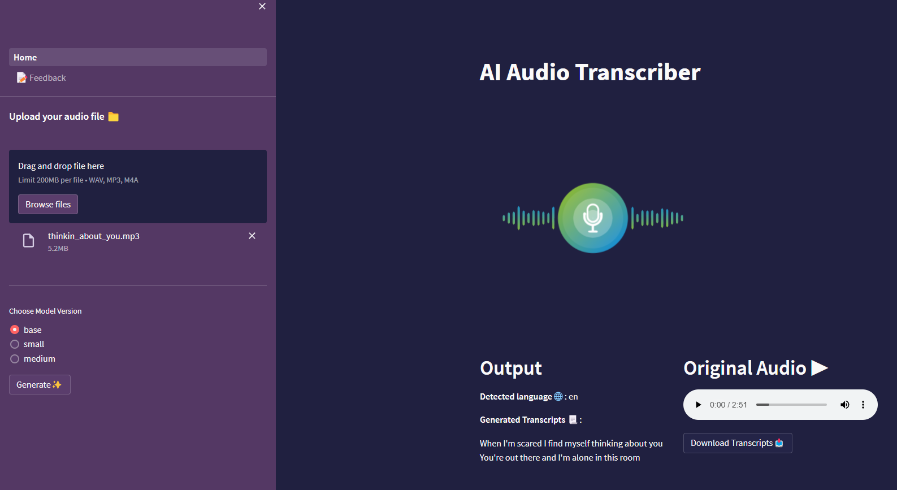
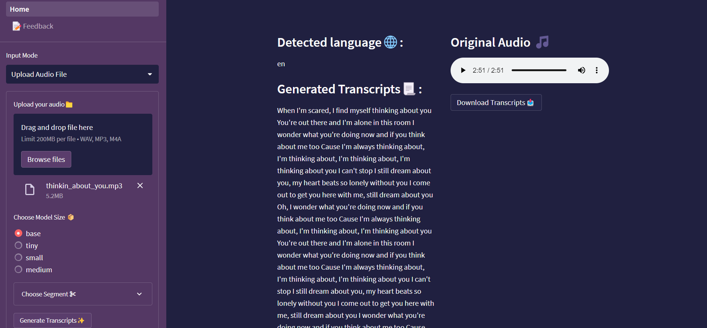
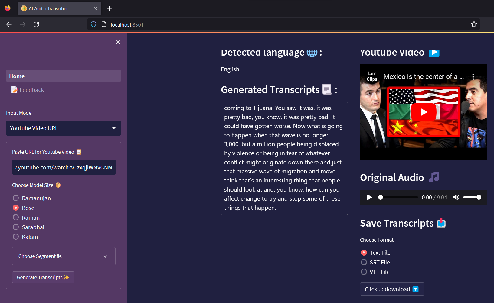
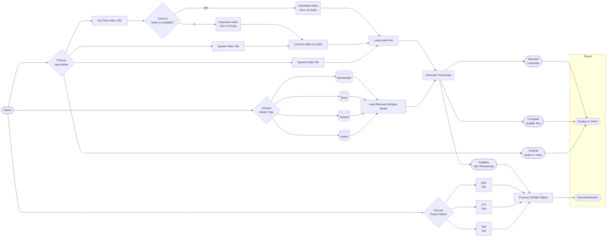
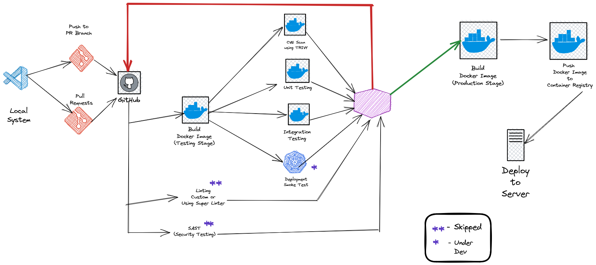

# AI Audio Transcriber

<p align = "center"></p>

A minimalistic application to generate transcriptions for audio built using Python

## 👇 Product Snapshots


#### Without Docker

**v.0.0.1**
<p align = "center"></p>

**v.0.0.2** (Transcribing a Youtube Video Explaining Whisper)
<p align = "center"></p>

**v.0.0.2** (Transcribing an English Song - Thinkin About It)
<p align = "center"></p>

**v.0.0.3** (Transcribing a [clip](https://www.youtube.com/watch?v=A1UjHboEypk) from [Lex Fridman's podcast](https://lexfridman.com/podcast/))

<p align = "center"></p>

**v.0.0.4** (Transcribing another [clip](https://www.youtube.com/watch?v=zxqjlWNVGNM) from [Lex Fridman's podcast](https://lexfridman.com/podcast/))

<p align = "center"></p>


## 📝 Basic Application WorkFlow 



## 🥊CI/CD

(**Preferred Pipeline Using GitHub Actions for Docker Image**)

<p align = "center"></p>


## ⚒️ Set-Up Instructions

<p align = "center"></p>


- Open your terminal / command prompt. 

- Clone the repository 
    ```
    git clone https://github.com/smaranjitghose/AIAudioTranscriber.git
    ```
- Change the directory to the cloned project
    
    ```
    cd AIAudioTranscriber
    ```

#### **A. Without using Docker**

- Ensure you have any version of [Python](https://www.python.org/downloads/) below 3.10 installed in your system and you have ``virtualenv`` package installed

    ```
    which python
    ```

    ```
    pip install virtualenv
    ```

- Create a new virtual environment
    ```
    python -m venv env
    ```

- Activate virtual enviroment
    - On Mac/Linux
        ```terminal
        source env/bin/activate
        ```
    - On Windows
        ```terminal
        env/Scripts/Activate.ps1 
        ```

- Install ffmpeg in your local syste,
    - On Windows using [Chocolatey](https://chocolatey.org/)
        ```terminal
        choco install ffmpeg
        ```
    - On MacOS using [Homebrew](https://brew.sh/)
        ```terminal
        brew install ffmpeg 
        ```
    - On Debian/Ubuntu
        ```terminal
        sudo apt update && sudo install ffmpeg
        ```
    - On Arch Linux
        ```terminal
        sudo pacman -S ffmpeg 
        ```

- Install the dependencies

    ```
    pip install -r requirements.txt
    ```

- Run the Web application
    ```
    streamlit run .\Home.py
    ```
    > **Note**:
    > - If the app does not load by itself in your default browser, open a browser of your choice and navigate to  `http://localhost:8501`
    > - To stop the application, press `CTRL + C` in your terminal

#### **B. Using Docker**

- Make sure you have Docker installed on your system. Refer the documentation [here](https://docs.docker.com/desktop/) if you need assistance setting up.
- Build a docker image
    ```
    docker run -t aitranscriber:v0.0.4 .
    ```
    > **Note**:
    > - You may give any name instead of aitranscriber and any tag instead of v0.0.4
    > - Depending on your system it takes a few minutes to successfully build the image
- Once complete, check the docker image
    ```
    docker images
    ```
- Create and run a Docker Container for the image
    ```
    docker run -p 8501:8501 aitranscriber:v0.0.4
    ```
    > **Note**:
    > - `docker run -p <hostport>:<8501> <container_name>:<tag_name>`
    > - In the above command, you can play around with which port of your host system you wish to map to the 8501 port of the container 
    > - If you used a different docker image name and/or different tag, make sure to update it in the command
- Open your preferred Web Browser and navigate to ``http://localhost:8501`` 
    > **Note**:
    > - If you used a different host port in the above command then navigate to that one, ``http://localhost:<host_port>``
    > - To stop the container, in the terminal check the containter name: ``docker ps --all``
    > - Now use container name with the command:  ``docker stop <container_name>``


## 🌏Deployment Options 

<p align = "center"></p>


- [Streamlit Cloud](https://streamlit.io/cloud)
- [HuggingFace Spaces](https://huggingface.co/docs/hub/spaces)

- [Fly](https://fly.io/)
- [Railway](https://railway.app/)
- [Render](https://render.com/)
- [Cyclic](https://app.cyclic.sh/#/)

- [Heroku](https://www.heroku.com/)
- [Digital Ocean](https://www.digitalocean.com/)

- Google Cloud Run
    - Install Google Cloud CLI
    - Create an Account on Google Cloud
    - Create a New Project
    - Build and Push Docker Image to Google Container Registry
        ```
        gcloud builds submit --tag gcr.io/<ProjectName>/<AppName>  --project=<ProjectName>
        ```
    - Deploy the Docker Container
        ```
        gcloud run deploy --image gcr.io/<ProjectName>/<AppName> --platform managed --project=<ProjectName> --allow-unauthenticated
        ```

- Amazon EC2 Instance
- Azure App

(**Using Google Colab/Kaggle as temporary MVP server**)

- [pyngrok](https://pyngrok.readthedocs.io/en/latest/index.html)
    - Step 1: Install pyngrok in Google Colab

        ```
        ! pip install pyngrok
        ```
    
    - Step 2: Sign-up in [ngrok](https://ngrok.com/) and get Authentication Token

    - Step 3: Authenticate
        
        ```python
           from pyngrok import ngrok
           ngrok.set_auth_token("xxx")
        ```
    - Step 4: Load the Streamlit App at port 8051, create a tunnel for it and reveal the public URL for the tunnel

        ```python
           !nohup streamlit run app.py --server.port 8051 &
           url = ngrok.connect(8051).public_url
           print(url)
        ```
    
    - Step 5: Share URL with client
     


- [localtunnel](https://github.com/localtunnel/localtunnel)
    - Step 1: Install localtunnel

        ```
        npm install -g localtunnel
        ```
    - Step 2

        ```
        streamlit run Home.py & npx localtunnel --port 8501
        ```
    
    - Step 3: Share URL with client


(**Using local server as temporary MVP server**)

- NGINX + Cloudfare/ngrok

## 🏗️ Future Work 

- [x] Download and use audio from Youtube Video
- [x] Download and use online audio file
- [x] Use Session States and Caching for Better UX
- [x] Display the language detected propely (without using the shortcode)
- [x] Generate Dedicated SRT,VTT files for transcripts (in addition to txt)
- [x] Update Model options to honour the name of prominent Indian Scientists
- [x] Option to limit/increase input model file size
- [x] Functionality to check the validity URL provided for Youtube Video
- [x] Add Custom Favicon File
- [x] Add Scrollable Text Area for Generated Transcripts
- [x] Containerize the Application with Docker
- [x] Troubleshoot Docker Container locally
- [x] Create Basic Workflow on GitHub Actions for Docker Image Build
- [x] Create Comprehensive Workflow on GitHub Actions for Docker Image Build
- [ ] Resolve bug: Youtube video with multiple audios should download default audio. 
    - Example: This [clip](https://www.youtube.com/watch?v=93L6gDVRrUY) from Huberman Lab is in English yet the script fetches the spanish audio codec from Youtube  

- [ ] Test Application by spinning up it's Container on Google Cloud Run
    - [ ] Push to a particular Docker Image Registry
    - [ ] Set TTL
    - [ ] Play around with system resources
    - [ ] Test with custom domain
- [ ] Add Google Cloud's CI/CD to repo on push/pull requests
    - [ ] Use cloudbuild.yaml file
    - [ ] Update build time to 2 hours
- [ ] Optimize Docker Image Size
- [ ] Better CI/CD
- [ ] Kubernetes Upgrade
- [ ] Better GitHub Actions

**More Features**:

- [ ] Burn transcripts to user-uploaded video
        ```python
        import os
        output_video = "final.mp4"

        os.system(f"ffmpeg -i {input_video} -vf subtitles={subtitle} {output_video}")
        ```
- [ ] Summarize subtitles
- [ ] Sentiment analysis on video summary
- [ ] Batch transcript generation + summary + sentiment analysis
- [ ] Dashboard for video review(s)


**Speaker Diarization: Only if Community requires**

- [ ] Incorporate Speaker Diarization for Podcast/Vlog/Conversational Clips
- [ ] Test it with burning transcripts to user uploaded video
- [ ] Test it with transcript summarization

**More Aligned Subtitles: Only if Community requires**

- [ ] Word Level Timestamps for transcripts + Generate ASS Transcript File
- [ ] Test it with burning transcripts to user uploaded video
- [ ] Test it with previous speaker diarization
- [ ] Test it with transcript summarization


- [ ] Improve UI Natively in Streamlit

**API Development: Only if Community requires**

- [ ] Build API for model inference in FastAPI to handle requests asynchronously (on a different branch perhaps)
- [ ] Containerize the API with Docker
- [ ] Troubleshoot Docker Container for API
- [ ] Host the API on Google/AWS/Linode/Heroku
- [ ] Perform basic CI/CD for API 
- [ ] Rehost Streamlit Application on a different service (Reduce it to client side for most operations)
- [ ] Play around with pyScript

**Front End Development: Only if Community requires**

- [ ] Build Basic React Front end
- [ ] Connect React Front End to FastAPI
- [ ] Add Loader Animation
- [ ] Add Animations for model inference times
- [ ] Handling Errors in Front End/API
- [ ] Upload File Component
- [ ] Download Button(s)
- [ ] Feedback Form
- [ ] Contact Page
- [ ] About Page
- [ ] Home Page
- [ ] Stripe Integration
- [ ] Improve Navbar UI
- [ ] 404 Page
- [ ] Footer UI
- [ ] Scrollbar UI
- [ ] SEO

**CI/CD Pipeline (GitHub Actions)**
- [ ] SAST (Optional)
- [ ] Kubernetes Smoke Test (Optional)
- [ ] Using Super Linter for Linting (Optional)
- [ ] Unit Tests (Optional)
- [ ] Integration Test (Optional)


## ✏️ Note 

<p align = "center"></p>

- To view the generated transcript file(s) in VS Code IDE install [Subtitles Editor](https://marketplace.visualstudio.com/items?itemName=pepri.subtitles-editor) extension
- To extensively edit/manipulate the generated transcript file(s) use the open source tool [Subtitle Edit](https://www.nikse.dk/subtitleedit) 
- For Streamlit Sharing, mentioning versions of the modules in requirements throws error at times
- Large Modelv2 outperforms all other versions of Whisper in terms of performance especially in Multi-lingual Transcription. However, it takes a 10 times more V-RAM than the base model and has longer inference time
- To quickly record audio from system microphone use [this](https://github.com/smaranjitghose/miscellaneous/blob/master/handypython/data/audio/audio_recording.py) Python Script:
    - Pre-requisities:

        ```
        pip install pyaudio wave
        ```
- Whisper is unable to read audio file from disk if ``python-ffmpeg`` or ``ffmpeg`` python pacakges are installed. It only works when ``ffmpeg-python`` python package is installed and not the former too

    ```
    # Remove all ffmpeg related python packages
    pip uninstall python-ffmpeg ffmpeg ffmpeg-python
    # Install the appropriate pacakge for ffmpeg
    pip install ffmpeg-python

    ```
- [Pixabay](https://pixabay.com/) has a great collection of copyright free, no royalty songs that one can use for testing the application
- Poor Performance for Kanada or Telegu songs (often language recognition itself fails) for base model. Example: Kantara movie's [Varaha Roopam](https://www.youtube.com/watch?v=gH_RYRwVrVM) Song

<p align = "center"></p>


#### Docker Container and CI/CD

- Exclude as much irrelevant files as possible with ```.dockerignore``` such as README.MD, LICENSE, snapshots, notebooks, input,output,logs, etc

- Minimize the number of layers (Created by RUN, COPY and ADD)
- Always combine ``RUN apt-get update`` with ``apt-get install`` in the same RUN statement. Using ``apt-get update`` alone in a RUN statement causes caching issues and subsequent ``apt-get install`` instructions fail.

- Using ``RUN apt-get update && apt-get install -y`` ensures your Dockerfile installs the latest package versions with no further coding or manual intervention. This technique is known as “cache busting”. 

- In addition, when you clean up the apt cache by removing ``/var/lib/apt/lists`` it reduces the image size, since the apt cache is not stored in a layer. 

- Python Docker Image Info:
    - Images tagged with `stretch`/`buster`/`jessie`/`buster`/`bullseye` are codenames for different [Debian Operating System](https://wiki.debian.org/DebianReleases) Production releases.
    - `bullseye` being version 11, buster being version 10, and so on. (2022) 
    - `bookworm`, `trixy` and `forky` are work-in-progress releases which may not be stable yet
    - `-slim` - only installs the minimal packages needed to run the particular tool.

- Base Image with python <= 3.9 raises [issue](https://stackoverflow.com/questions/71712258/error-could-not-build-wheels-for-backports-zoneinfo-which-is-required-to-insta/71735458#71735458) with module `backports.zoneinfo`and pip fails


- To build and test multi-architecture docker images locally,
    - Create a new buildx instance
        ```
        docker buildx create --use
        ```
    - Build a new docker image for multi-architecture support
        ```
         docker buildx build --platform linux/arm64,linux/amd64 -t aitranscriber:multi-architecture -f Dockerfile . 
        ```

- Checking Docker Image Build for multi-architecture is too time consuming for the current application and disabled


## 🙏 Acknowledgements 

<p align = "center"></p>


- **General Purpose Speech Recognition Model**: [OpenAI Whisper](https://openai.com/blog/whisper/) 
    - [GitHub](https://github.com/openai/whisper)
    - [Paper:Robust Speech Recognition via Large-Scale Weak Supervision](https://arxiv.org/pdf/2212.04356.pdf)
- **Animations**: [LottieFiles](https://lottiefiles.com)
- **Favicon**: [PNG Repo](https://www.pngrepo.com/svg/235200/artificial-intelligence-brain)
- **Sample Test Clip 1**: [" Thinkin About It "](https://pixabay.com/music/soft-house-setze-thinkin-about-you-radio-edit-129282/) by [Niklas Setzkorn](https://pixabay.com/users/setze-32054623/) </a> from [Pixabay](https://pixabay.com/)

